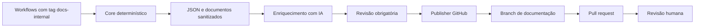

# Documentação automática de projetos n8n

Este repositório contém um pipeline reutilizável para documentar workflows de uma instância n8n, enriquecer a documentação opcionalmente com IA e publicar o resultado em uma branch do GitHub para revisão humana.

> Os templates não incluem credenciais. Toda documentação gerada deve ser revisada antes do merge.

## O que está incluído

| Workflow | Responsabilidade | Template |
| --- | --- | --- |
| Core | Seleciona workflows por tag, sanitiza o JSON e gera documentação determinística | [`core-documentation.json`](workflows/core-documentation.json) |
| Enriquecimento com IA | Analisa somente o JSON sanitizado e propõe contexto, riscos e troubleshooting | [`ai-enrichment.json`](workflows/ai-enrichment.json) |
| Publisher | Publica os arquivos sequencialmente em uma branch do GitHub | [`github-publisher.json`](workflows/github-publisher.json) |

O fluxo foi validado com n8n `2.28.6`. Versões diferentes podem exigir a atualização da versão de algum nó.

## Fluxo



A IA não sanitiza credenciais e não escreve diretamente no GitHub. Essas responsabilidades permanecem em etapas determinísticas.

## Instalação rápida

1. Baixe ou clone este repositório.
2. Importe os três arquivos da pasta [`workflows/`](workflows/) no n8n, na ordem Core, IA e Publisher.
3. Configure uma credencial da API do n8n no Core.
4. Configure uma credencial OpenAI no workflow de IA.
5. Configure uma credencial GitHub nos dois nós indicados do Publisher.
6. Selecione novamente os subworkflows nos nós `Execute Workflow`, porque os IDs mudam após a importação.
7. Edite usuário, repositório e branch no nó `Expandir arquivos` do Publisher.
8. Aplique a tag `docs-internal` apenas aos workflows que deseja documentar.
9. Ative o Core e a IA. Mantenha o Publisher inativo para execução manual.
10. Execute o Publisher e revise a branch antes do merge.

As instruções completas estão em [Instalação](docs/INSTALLATION.md) e [Configuração](docs/CONFIGURATION.md).

## Arquivos gerados por projeto

```text
projects/<slug-do-workflow>/
├── README.md
├── workflow.sanitized.json
├── architecture.mmd
├── metadata.json
├── AI_PROMPT.md
└── docs/
    ├── runbook.md
    ├── troubleshooting.md
    └── ai-enrichment.md
```

O exemplo atual pode ser consultado em [`projects/mvp-documentacao-interna-n8n-local/`](projects/mvp-documentacao-interna-n8n-local/).

## Documentos escritos por pessoas ou agentes

Documentos produzidos por uma pessoa, Codex, Claude ou por conversas exportadas podem coexistir com os arquivos gerados. Use caminhos sob `docs/contributed/` e não reutilize os nomes reservados acima.

O pipeline atual preserva arquivos extras do repositório, mas ainda não os envia automaticamente para a IA. Consulte [Documentos contribuídos](docs/CONTRIBUTING-DOCUMENTS.md).

## Guias

- [Instalação em outra instância](docs/INSTALLATION.md)
- [Configuração dos workflows](docs/CONFIGURATION.md)
- [Arquitetura e contratos de dados](docs/ARCHITECTURE.md)
- [Documentos humanos, de agentes e conversas](docs/CONTRIBUTING-DOCUMENTS.md)
- [Segurança](docs/SECURITY.md)

## Manutenção dos templates

Quem mantém este repositório pode regenerar os três exports diretamente de uma instância n8n:

```bash
cp .env.example .env
# Preencha a URL, a chave da API e os três IDs.
set -a
source .env
set +a
node scripts/export-workflow-templates.mjs
node scripts/validate-repository.mjs
```

O exportador remove referências de credenciais, elimina configurações somente de leitura e substitui IDs de subworkflows por marcadores portáteis. O GitHub também executa a validação em pull requests.
