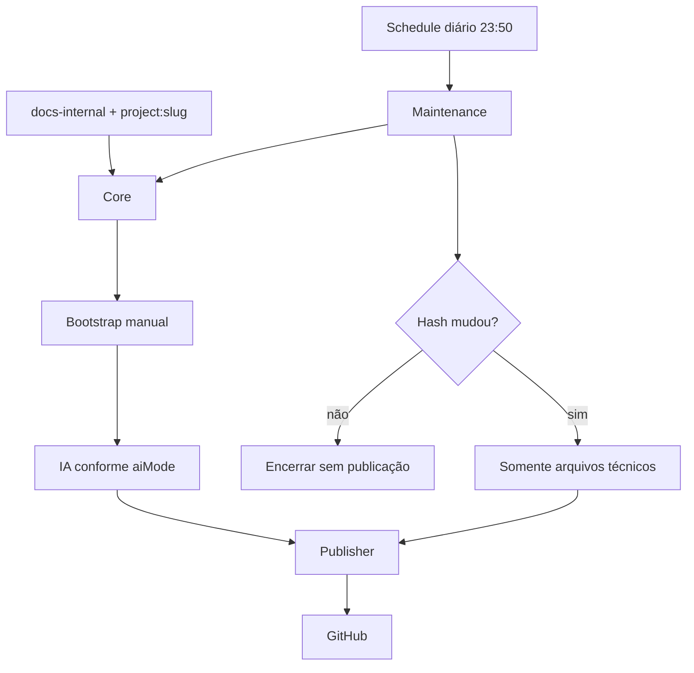

# Documentação versionada de projetos n8n

Este repositório contém um pipeline reutilizável para agrupar workflows n8n em projetos, gerar a documentação inicial e manter snapshots técnicos diários no GitHub sem sobrescrever documentos mantidos pelo time.

> Os templates não incluem credenciais. Toda saída automática mantém `reviewRequired: true`.

## Workflows do pipeline

| Workflow | Responsabilidade | Template |
| --- | --- | --- |
| Core | Agrupa workflows pelas tags `docs-internal` e `project:<slug>`, sanitiza e calcula o hash funcional | [core-documentation.json](workflows/core-documentation.json) |
| IA | Enriquece um projeto sanitizado no Bootstrap ou em mudanças com `aiMode: on-change` | [ai-enrichment.json](workflows/ai-enrichment.json) |
| Publisher | Recebe caminhos completos, ignora conteúdo idêntico e publica serialmente | [github-publisher.json](workflows/github-publisher.json) |
| Bootstrap | Cria uma vez os arquivos humanos e técnicos de um projeto | [bootstrap-documentation.json](workflows/bootstrap-documentation.json) |
| Maintenance | Compara hashes diariamente e atualiza somente arquivos técnicos | [daily-maintenance.json](workflows/daily-maintenance.json) |

O fluxo foi validado com n8n `2.28.6`.

## Ciclo de vida



Depois do Bootstrap, `README.md` e `docs/` pertencem ao time. A Maintenance atualiza apenas `workflows/`, `generated/` e `project.json`.

## Identificação dos projetos

Todo workflow documentado precisa de exatamente duas informações:

```text
docs-internal
project:<slug-do-projeto>
```

Tags opcionais descrevem o papel do componente:

```text
component:agent
component:tool
component:subflow
```

Vários workflows com o mesmo `project:<slug>` formam um único projeto e compartilham uma versão.

## Instalação rápida

1. Importe os cinco templates da pasta [workflows](workflows/).
2. Configure as credenciais n8n, OpenAI e GitHub.
3. Selecione novamente os subworkflows nos nós `Execute Workflow`.
4. Configure usuário, repositório e branch no Bootstrap e na Maintenance.
5. Aplique `docs-internal` e `project:<slug>` aos workflows de negócio.
6. Ative Core, Publisher e Maintenance. Ative a IA apenas se algum projeto usar IA.
7. Execute o Bootstrap manualmente para cada projeto novo.

Consulte [Instalação](docs/INSTALLATION.md), [Configuração](docs/CONFIGURATION.md) e [Ciclo de vida](docs/LIFECYCLE.md).

## Estrutura por projeto

```text
projects/<project-slug>/
├── project.json
├── README.md
├── workflows/
│   └── <workflow>.sanitized.json
├── generated/
│   ├── architecture.mmd
│   ├── workflow-index.md
│   └── ai-change-analysis.md
└── docs/
    ├── runbook.md
    ├── troubleshooting.md
    ├── ai-enrichment.md
    └── contributed/
```

O exemplo do novo ciclo está em [projects/mvp-docs](projects/mvp-docs/). O diretório antigo `mvp-documentacao-interna-n8n-local` permanece apenas como referência do protótipo anterior.

## Guias

- [Instalação em outra instância](docs/INSTALLATION.md)
- [Configuração dos workflows](docs/CONFIGURATION.md)
- [Arquitetura e contratos](docs/ARCHITECTURE.md)
- [Bootstrap e Maintenance](docs/LIFECYCLE.md)
- [Documentos humanos e de agentes](docs/CONTRIBUTING-DOCUMENTS.md)
- [Segurança](docs/SECURITY.md)

## Manutenção dos templates

Preencha a URL, a chave da API e os cinco IDs em `.env`:

```bash
set -a
source .env
set +a
node scripts/export-workflow-templates.mjs
node scripts/validate-repository.mjs
```

O exportador remove credenciais e troca IDs locais de subworkflows por marcadores portáteis.
