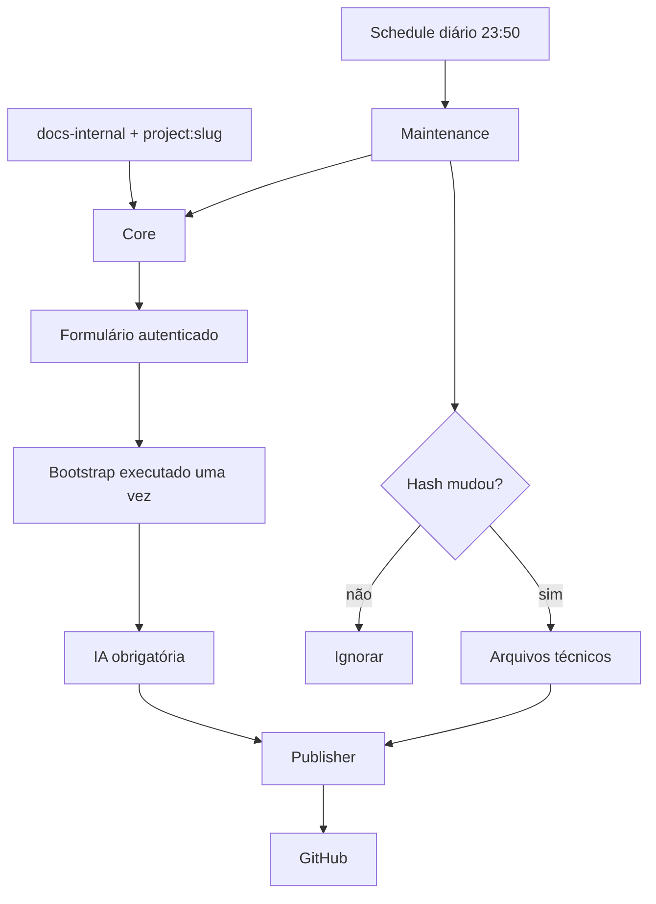

# Documentação versionada de projetos n8n

Pipeline reutilizável para agrupar workflows n8n em projetos, gerar uma documentação inicial com IA e manter snapshots técnicos versionados no GitHub.

O fluxo foi validado com n8n `2.28.6`. Os templates não incluem credenciais e toda saída automática mantém `reviewRequired: true`.

> A pasta [projects](projects/) contém apenas exemplos gerados por esta instalação. O usuário final não precisa clonar nem manter uma cópia local deste repositório. Depois de importar os seis templates no n8n, `owner`, `repository` e `branch` podem apontar para qualquer repositório GitHub ao qual a credencial tenha acesso; toda a leitura e publicação acontece pelas APIs do n8n e do GitHub.

## O que é gerado

No repositório GitHub escolhido pelo usuário, cada projeto ocupa uma pasta:

```text
projects/<project-slug>/
├── README.md                         # humano, gerado no Bootstrap
├── docs/
│   └── architecture.mmd              # humano, gerado no Bootstrap
├── workflows/
│   └── <workflow>.sanitized.json     # técnico, atualizado diariamente
└── project.json                      # técnico, versão e hash do projeto
```

Depois do Bootstrap, o time pode editar `README.md` e `docs/**`. A Maintenance nunca sobrescreve esses arquivos; ela atualiza somente `workflows/**` e `project.json`.

O repositório de destino pode ser este mesmo repositório, um monorepo já existente ou um repositório exclusivo para documentação. Não é necessário executar scripts locais durante o uso normal.

## Como o pipeline funciona



### Os seis workflows

| Workflow | O que faz | Quando é usado | Template |
| --- | --- | --- | --- |
| **Core** | Lê os workflows da instância, agrupa por projeto, sanitiza dados, encontra dependências e calcula o hash funcional | Descoberta, Bootstrap e Maintenance | [core-documentation.json](workflows/core-documentation.json) |
| **IA** | Recebe somente o snapshot sanitizado e gera `README.md` e `docs/architecture.mmd` | Obrigatoriamente no primeiro Bootstrap; nunca na Maintenance | [ai-enrichment.json](workflows/ai-enrichment.json) |
| **Publisher** | Compara e cria/atualiza arquivos no GitHub, em série, ignorando conteúdo idêntico | Bootstrap e Maintenance | [github-publisher.json](workflows/github-publisher.json) |
| **Bootstrap** | Valida que o projeto ainda não foi inicializado, chama Core, IA e Publisher e grava `project.json` por último | Uma vez por projeto | [bootstrap-documentation.json](workflows/bootstrap-documentation.json) |
| **Formulário** | Descobre projetos ainda não publicados e permite que um usuário autenticado escolha qual inicializar | Entrada humana oficial do Bootstrap | [bootstrap-form.json](workflows/bootstrap-form.json) |
| **Maintenance** | Compara o hash atual com o GitHub e publica somente os arquivos técnicos quando houver mudança | Diariamente às 23:50 ou manualmente | [daily-maintenance.json](workflows/daily-maintenance.json) |

## Instalação na instância n8n

### 1. Importe os templates

Importe os seis arquivos da pasta [workflows](workflows/) nesta ordem:

1. Core;
2. IA;
3. Publisher;
4. Bootstrap;
5. Formulário;
6. Maintenance.

Você pode colocá-los em um folder como `githubDocs`.

### 2. Configure as credenciais

| Workflow | Node | Credencial necessária |
| --- | --- | --- |
| Core | `Listar workflows` | API da própria instância n8n, com leitura de workflows e tags |
| IA | `Modelo OpenAI` | OpenAI API |
| Publisher | `Consultar arquivo existente` e `Criar ou atualizar no GitHub` | GitHub com leitura e escrita no repositório |
| Bootstrap | `Consultar projeto existente` | GitHub com leitura |
| Formulário | `Listar projetos já publicados` | GitHub com leitura |
| Maintenance | `Consultar project.json remoto` | GitHub com leitura |

O Form Trigger deve continuar protegido por `n8n User Auth`. Em Docker, a URL usada pela credencial n8n precisa ser acessível de dentro do container.

### 3. Selecione os subworkflows

Os templates usam placeholders. Depois da importação, abra os nodes `Execute Workflow` e selecione:

| Workflow | Node | Selecionar |
| --- | --- | --- |
| IA | `Executar Core determinístico` | Core |
| Bootstrap | `Executar Core do projeto` | Core |
| Bootstrap | `Executar enriquecimento inicial` | IA |
| Bootstrap | `Publicar Bootstrap` | Publisher |
| Formulário | `Descobrir projetos documentáveis` | Core |
| Formulário | `Executar Bootstrap selecionado` | Bootstrap |
| Maintenance | `Executar Core diário` | Core |
| Maintenance | `Publicar Maintenance` | Publisher |

### 4. Configure o GitHub

Nos Edit Fields do Formulário, Bootstrap e Maintenance, informe:

```text
owner       = usuário ou organização
repository  = nome do repositório, sem URL
branch      = branch já existente, por exemplo docs/generated
```

Mantenha os valores controlados:

```text
aiMode = bootstrap
forceBootstrap = false
```

`documentationMode` é fixo em cada workflow: `form-discovery` no Formulário, `bootstrap` no Bootstrap e `maintenance` na Maintenance.

Use preferencialmente uma branch dedicada e revisão por pull request.

Consulte o [dicionário completo de configurações](docs/CONFIGURATION.md#dicionário-de-campos) para saber onde cada campo aparece, quais valores são livres ou controlados e o efeito de cada opção. Em especial, `aiMode=bootstrap` registra a política atual: IA obrigatória no Bootstrap e nenhuma IA na Maintenance.


### 5. Ative os workflows

Ative Core, IA, Publisher, Bootstrap e Formulário. Ative a Maintenance depois de validar o primeiro Bootstrap. O Schedule padrão é `50 23 * * *`, no fuso `America/Sao_Paulo`.

## Como identificar um projeto

Todo workflow de negócio que deve entrar na documentação precisa destas tags:

```text
docs-internal
project:<slug-do-projeto>
```

Exemplo:

```text
docs-internal
project:carteira-invest
```

Todos os workflows do mesmo projeto — agente, tools e subworkflows — usam o mesmo `project:<slug>`. Um workflow documentado deve possuir exatamente uma tag de projeto.

As tags opcionais descrevem o papel de cada componente:

```text
component:agent
component:tool
component:subflow
```

Referências por ID em `Execute Workflow` e `Workflow Tool` são descobertas pelo Core. Dependências escolhidas dinamicamente por expressão precisam ser conferidas manualmente.

| Situação | Preparação principal | Quando executar o Bootstrap |
| --- | --- | --- |
| Projeto começando agora | Aplicar as tags enquanto os workflows são criados | Quando existir uma primeira arquitetura funcional |
| Projeto já em produção | Inventariar e etiquetar todos os componentes antes de documentar | Depois de validar o projeto completo com o Core |

## Cenário A — documentar um projeto desde o início

Não execute o Bootstrap com um projeto vazio. Aguarde uma primeira arquitetura minimamente funcional; a IA documentará o estado existente naquele momento.

1. Escolha um slug estável, como `carteira-invest`.
2. À medida que criar os workflows, aplique `docs-internal` e `project:carteira-invest`.
3. Marque agentes, tools e subworkflows com as tags de componente quando aplicável.
4. Conecte as dependências usando `Execute Workflow` ou `Workflow Tool`.
5. Quando a primeira versão funcional estiver pronta, execute o Core manualmente com `projectSlug=carteira-invest` e confira os componentes encontrados.
6. Abra `/form/bootstrap-documentacao`, carregue os projetos e escolha `carteira-invest`.
7. O Formulário executará `Bootstrap → Core → IA → Publisher`.
8. Revise no GitHub o `README.md`, a arquitetura, os JSONs sanitizados e o `project.json`.
9. A partir daí, edite os documentos humanos quando necessário e deixe a Maintenance cuidar dos snapshots técnicos.

Se a arquitetura crescer depois do Bootstrap, a Maintenance registrará os novos workflows técnicos, mas não regenerará o README ou o Mermaid. Atualize-os manualmente ou faça um rebootstrap controlado somente após revisar o impacto.

## Cenário B — documentar um projeto que já está em produção

O pipeline não altera a lógica, ativação ou credenciais dos workflows de negócio. Antes do Bootstrap, porém, é importante mapear o projeto inteiro para evitar uma documentação inicial incompleta.

1. Identifique o workflow principal, agentes, tools, subworkflows, webhooks auxiliares e schedules relacionados.
2. Escolha um slug único para o conjunto, como `agente-vendas`.
3. Aplique `docs-internal` e `project:agente-vendas` em todos os componentes.
4. Aplique `component:agent`, `component:tool` e `component:subflow` quando apropriado.
5. Verifique dependências dinâmicas que o Core talvez não consiga resolver por ID.
6. Execute o Core manualmente com `projectSlug=agente-vendas`.
7. Confirme que todos os componentes esperados — e nenhum workflow externo — aparecem no snapshot.
8. Confirme que `projects/agente-vendas/project.json` ainda não existe no destino.
9. Abra o formulário, selecione o projeto e execute o Bootstrap uma única vez.
10. Compare o README e a arquitetura gerados com o funcionamento real de produção e faça os ajustes humanos necessários.
11. Ative a Maintenance diária.

Adicionar tags muda apenas os metadados dos workflows no n8n. O Core faz leitura e sanitização; a publicação ocorre somente no repositório GitHub configurado.

## Depois do Bootstrap

| Caminho | Responsável | Atualização |
| --- | --- | --- |
| `README.md` | Pessoas ou agentes | Manual, após revisão |
| `docs/**` | Pessoas ou agentes | Manual, após revisão |
| `workflows/**` | Maintenance | Quando o hash funcional mudar |
| `project.json` | Bootstrap/Maintenance | Ao publicar uma versão |

O `currentVersion` segue `YYYY.MM.DD.N`. O Git continua sendo o histórico completo.

Se `project.json` já existir, o Bootstrap normal bloqueia uma segunda inicialização e o Formulário não oferece o projeto novamente. `forceBootstrap=true` é uma operação excepcional que pode sobrescrever documentos humanos; use apenas com revisão explícita.

## Referência detalhada

O README contém o caminho normal de instalação e uso. Consulte os arquivos abaixo somente quando precisar de detalhes:

- [Inputs, opções e credenciais de cada workflow](docs/inputs/README.md)
- [Arquitetura e contratos internos](docs/ARCHITECTURE.md)
- [Versionamento, falhas e recuperação](docs/LIFECYCLE.md)
- [Documentos mantidos por pessoas ou agentes](docs/CONTRIBUTING-DOCUMENTS.md)
- [Segurança e limites de confiança](docs/SECURITY.md)
- [Checklist detalhado de implantação](docs/INSTALLATION.md)
- [Tags e configurações avançadas](docs/CONFIGURATION.md)
- [Manutenção e reexportação dos templates](docs/MAINTAINING-TEMPLATES.md)
