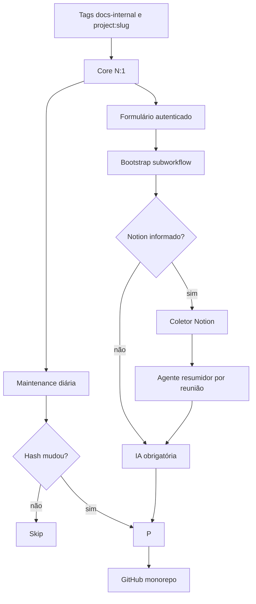

# Arquitetura e contratos

## Componentes



## Contrato do Core

```json
{
  "kind": "project",
  "projectSlug": "agente-vendas",
  "functionalHash": "hash-agregado",
  "components": [],
  "dependencies": [],
  "humanFiles": {},
  "technicalFiles": {
    "workflows/agente.sanitized.json": "...",
    "project.json": "..."
  },
  "reviewRequired": true
}
```

O hash agrega os hashes funcionais de todos os componentes e suas dependências. Credenciais, IDs de credenciais e caminhos privados não participam do conteúdo público.

## Agentes, tools e subworkflows

O `project.json` registra cada componente com `componentId`, papel, hash e ID local. Dependências diretas formam relações `usesTool` ou `callsSubflow` e são fornecidas à IA para a criação da arquitetura.

Uma tool compartilhada é documentada uma vez e pode aparecer como dependência de vários agentes.

## Contrato da IA

A IA recebe o snapshot sanitizado do Core, os documentos humanos anteriores sanitizados no rebootstrap e, opcionalmente, os resumos sanitizados das reuniões do Notion. Cada reunião é resumida separadamente antes da IA principal para controlar o tamanho do contexto. O layout é fixo:

```text
projects/
├── README.md                        # índice e seção global #pr-review
└── <slug>/
    ├── README.md                    # mapa operacional e Mermaid
    └── docs/
        ├── TECHNICAL.md             # arquitetura e operação
        ├── INTERNAL.md              # contexto humano e organizacional
        ├── DECISIONS_AND_LEARNINGS.md # registro consultivo preservado
        └── workflows/<workflow-slug>.md
```

`README.md` é montado deterministicamente a partir do resumo, dos componentes e de seções já validadas do documento técnico. Ele contém visão geral, componentes, fluxo principal ou prioritário, entradas e saídas, integrações, operação e o mesmo Mermaid da arquitetura. `TECHNICAL.md` aprofunda objetivo, usuários, gatilhos, fluxo, índice dos workflows, Mermaid, integrações, IA, dados, saídas, operação, erros e limitações. `INTERNAL.md` recebe nome e tipo do projeto, datas, responsáveis, repositório, cliente, relacionamento, descrição do produto, escopo, decisões, riscos e pendências. `DECISIONS_AND_LEARNINGS.md` é um registro consultivo determinístico: o primeiro Bootstrap cria o esqueleto e os seguintes preservam o conteúdo existente.

A seção `#pr-review` não pertence a um projeto específico: fica em `projects/README.md` e orienta a revisão de todos os PRs. O arquivo é criado se estiver ausente ou vazio; quando já possui conteúdo, tudo fora dos marcadores é preservado. Pendências específicas permanecem nas seções de confirmação dos documentos do projeto e em `aiDocumentation.pendingReviewItems`.

Cada documento individual de workflow contém, nesta ordem:

1. papel no projeto;
2. gatilhos e entradas;
3. etapas principais;
4. integrações e tipos de credenciais;
5. dependências;
6. saídas;
7. tratamento de erros;
8. limitações e pontos de confirmação.

Quando uma informação não estiver comprovada, a IA escreve `Precisa de confirmação`; quando não se aplicar, utiliza `Não se aplica`. Datas de atualização dos workflows não podem ser tratadas como datas do projeto. Cliente, responsáveis e relacionamento não podem ser inferidos. No rebootstrap, fatos do README legado e dos documentos separados são preservados e movidos para o arquivo correto; divergências ficam como pendências.

Os resumos das reuniões do Notion são usados prioritariamente no documento interno. Uma afirmação técnica presente na reunião só entra como fato técnico quando também for comprovada pelo snapshot do workflow; caso contrário, vira ponto de confirmação. Antes de retornar ao Bootstrap, a IA remove os resumos, a URL e os IDs. Somente `contextSources.notion`, incluindo contagem de resumos e fallbacks, segue para `project.json`.

A montagem valida todos os títulos, exige exatamente um documento por `workflowSlug` e rejeita seções vazias, duplicadas ou desconhecidas. O Mermaid é normalizado para `ID["rótulo"]` e incorporado em `docs/TECHNICAL.md`; não existe `architecture.mmd` separado.

A Maintenance não chama a IA. Depois do Bootstrap, esses documentos podem ser revisados pelo time sem risco de sobrescrita diária.

## Contrato do Publisher

O Publisher recebe exatamente um payload de publicação por execução e não conhece regras de Bootstrap ou Maintenance. Ele aceita escrita somente em `projects/**`, o que inclui o índice `projects/README.md`. A única remoção permitida na raiz é a do `PR_REVIEW.md` legado.

Ele lê a referência e o commit da `baseBranch` (ou da própria branch de destino por compatibilidade), cria uma nova tree, compara os SHAs e, quando há mudança, cria um único commit com todos os arquivos. A referência de destino só é movida no final e com `force=false`. Quando autorizado pelo payload e a referência estiver ausente, o Publisher cria a branch apontando para o novo commit. Portanto, `project.json`, documentos e snapshots tornam-se visíveis juntos; a ordem dos arquivos no payload não possui mais função transacional.

## Falhas e idempotência

- Core falhou: nada é publicado.
- Notion não configurado: o Bootstrap continua normalmente sem reuniões.
- Notion configurado mas inacessível: o Bootstrap falha antes da IA para não gerar um documento interno fingindo ter lido as reuniões.
- IA falhou: a publicação do projeto é interrompida.
- Publisher falhou antes de atualizar a referência: a branch permanece no commit anterior; objetos Git ainda não referenciados podem existir, mas nenhum arquivo parcial fica visível.
- A branch avançou durante a execução: o update sem force falha e a execução deve ser repetida sobre a nova base.
- Branch auxiliar ausente: a Maintenance pode recriá-la a partir da `main` sem force.
- Hash igual à `main`: Maintenance não chama Publisher.
- Hash igual somente à branch auxiliar: Maintenance reporta revisão pendente e não duplica o commit.
- Projeto sem `project.json` concluído: Maintenance exige Bootstrap.
