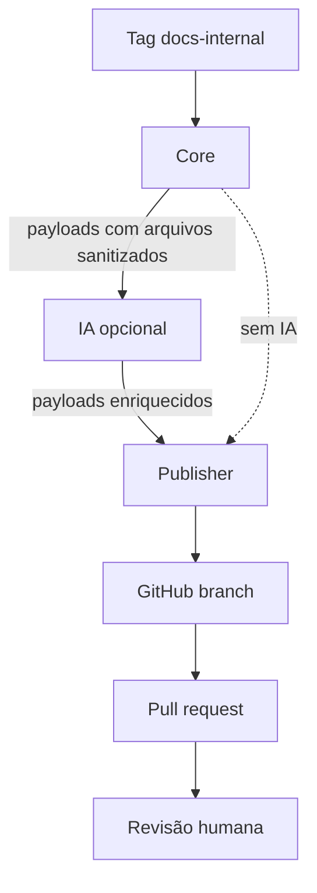

# Arquitetura e contratos de dados

O projeto divide responsabilidades para que geração, IA e publicação possam falhar ou ser substituídas independentemente.

## Componentes



## Contrato do Core

O Core retorna um resumo com uma lista `payloads`. Cada projeto possui:

```json
{
  "kind": "project",
  "workflowId": "ID_LOCAL",
  "title": "Nome do workflow",
  "metadata": {},
  "files": {
    "README.md": "...",
    "workflow.sanitized.json": "..."
  },
  "reviewRequired": true
}
```

Os IDs locais são usados apenas durante a execução. Os templates deste repositório não preservam IDs de credenciais ou referências de subworkflows da instância mantenedora.

## Contrato da IA

A IA preserva o payload recebido e acrescenta `aiEnrichment` e `docs/ai-enrichment.md`.

```json
{
  "summary": "...",
  "businessPurpose": "...",
  "inputs": [],
  "outputs": [],
  "integrations": [],
  "risks": [],
  "troubleshootingSuggestions": [],
  "reviewNotes": [],
  "confidence": "low"
}
```

O valor de `confidence` não aprova o conteúdo. `reviewRequired` permanece verdadeiro em todos os casos.

## Contrato do Publisher

O Publisher percorre dinamicamente todas as entradas de `files`. Portanto, novos documentos podem ser publicados sem alterar os nós do GitHub, desde que uma etapa anterior os adicione ao payload com um caminho relativo seguro.

O caminho final segue esta regra:

```text
projects/<slug-do-título>/<caminho-relativo>
```

Antes de aceitar caminhos de fontes externas, implemente validação para impedir caminhos absolutos, segmentos `..`, extensões não permitidas e arquivos excessivamente grandes.

## Falhas isoladas

- Se o Core falhar, nenhum documento é enviado à IA ou ao GitHub.
- Se a IA falhar, o Publisher integrado também interrompe. É possível usar o modo sem IA descrito na instalação.
- Se um arquivo falhar no GitHub, o resumo do Publisher não é concluído.
- O loop serial reduz conflitos internos, mas alterações simultâneas no mesmo arquivo ainda podem produzir HTTP `409`.

## Extensões previstas

Uma etapa futura de ingestão pode normalizar documentos escritos por pessoas, agentes CLI ou conversas exportadas. Ela deve ficar entre o Core e a IA e produzir caminhos sob `docs/contributed/`.
