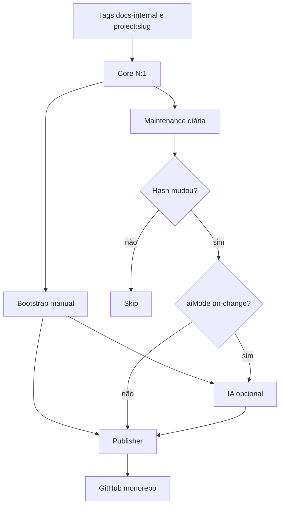

# Arquitetura e contratos

## Componentes



## Contrato do Core

```json
{
  "kind": "project",
  "projectSlug": "agente-vendas",
  "functionalHash": "hash-agregado",
  "components": [],
  "dependencies": [],
  "humanFiles": {
    "README.md": "...",
    "docs/runbook.md": "..."
  },
  "technicalFiles": {
    "workflows/agente.sanitized.json": "...",
    "generated/architecture.mmd": "...",
    "project.json": "..."
  },
  "reviewRequired": true
}
```

O hash agrega os hashes funcionais de todos os componentes e suas dependências. Credenciais, IDs de credenciais e caminhos privados não participam do conteúdo público.

## Agentes, tools e subworkflows

O `project.json` registra cada componente com `componentId`, papel, hash e ID local. Dependências diretas formam relações `usesTool` ou `callsSubflow` e alimentam `generated/architecture.mmd`.

Uma tool compartilhada é documentada uma vez e pode aparecer como dependência de vários agentes.

## Contrato da IA

A IA preserva `humanFiles` e `technicalFiles` e acrescenta `aiEnrichment` estruturado. O destino do Markdown depende de `documentationMode`:

- `bootstrap` → `docs/ai-enrichment.md`;
- `maintenance` → `generated/ai-change-analysis.md`.

## Contrato do Publisher

O Publisher recebe caminhos completos e não conhece regras de Bootstrap ou Maintenance. Cada arquivo é consultado, comparado e então criado, atualizado ou ignorado.

Como a escrita é serial, os orquestradores enviam `project.json` por último. Assim ele funciona como marcador de uma versão completamente publicada.

## Falhas e idempotência

- Core falhou: nada é publicado.
- IA falhou: a publicação do projeto é interrompida.
- Publisher falhou antes de `project.json`: a próxima execução ainda pode recuperar os arquivos.
- Hash igual: Maintenance não chama IA nem Publisher.
- Projeto sem `project.json` concluído: Maintenance exige Bootstrap.
