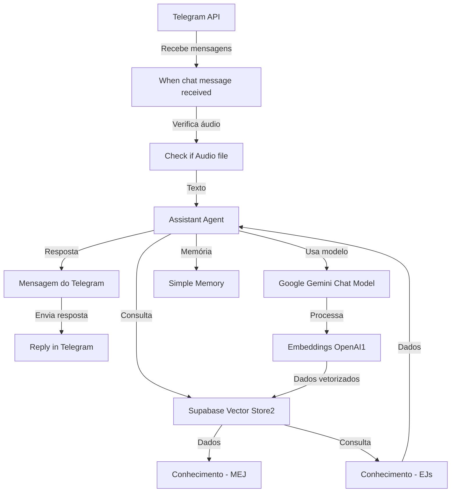

# Agente Mej

## Visão geral

O projeto Agente Mej é uma implementação de um workflow automatizado que utiliza inteligência artificial para interagir com mensagens de chat, especificamente através do Telegram. O sistema é projetado para identificar mensagens, processar conteúdo e responder de forma inteligente. Este projeto inclui um workflow principal chamado MVP, que contém diversos nós responsáveis pela lógica de processamento e resposta.

## Componentes

- **[MVP](docs/workflows/mvp.md)** — Workflow.

## Fluxo principal

1. Recebimento de mensagem do Telegram.
2. Verificação se a mensagem contém um arquivo de áudio.
3. Processamento da mensagem utilizando modelos de linguagem e ferramentas de IA.
4. Armazenamento e recuperação de informações relevantes.
5. Envio de resposta através do Telegram.

## Entradas e saídas

### Entradas

O gatilho principal é o recebimento de mensagens através do Telegram. As entradas incluem mensagens de texto e, potencialmente, arquivos de áudio.

### Saídas

As saídas são respostas processadas que são enviadas de volta ao chat do Telegram.

## Integrações

- Telegram para recebimento e envio de mensagens.
- Google Gemini e OpenAI para processamento de linguagem natural.
- Supabase para armazenamento de dados.

## Operação

O workflow é ativado por eventos de mensagens recebidas no Telegram e processa as informações conforme configurado nos nós do workflow.

## Arquitetura

## Documentação detalhada

- [Documentação técnica completa](docs/TECHNICAL.md)
- [Contexto interno](docs/INTERNAL.md)
- [Roteiro de revisão do PR](../README.md#pr-review)
- [Documentação individual dos workflows](docs/workflows/)

Documentação gerada pelo Bootstrap do n8n. A revisão humana é obrigatória antes da aprovação do PR.
