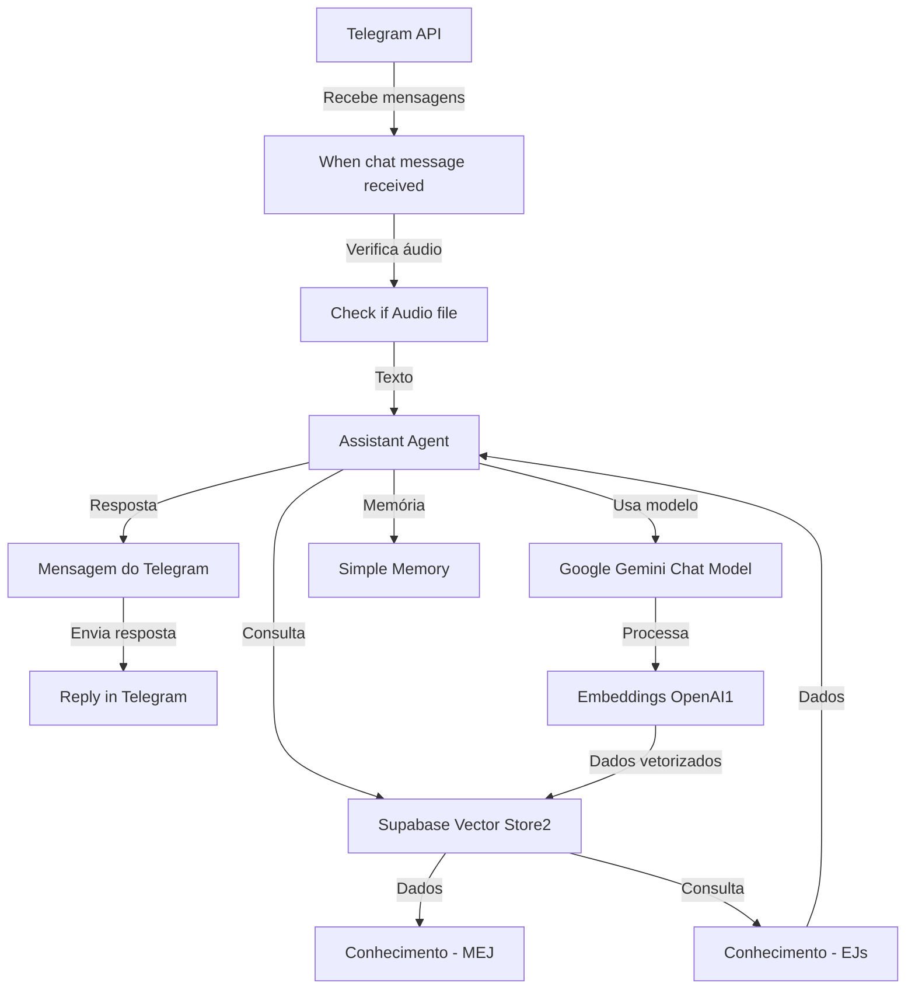

# Documentação técnica — Agente Mej
## Visão técnica
O projeto Agente Mej é uma implementação de um workflow automatizado que utiliza inteligência artificial para interagir com mensagens de chat, especificamente através do Telegram. O sistema é projetado para identificar mensagens, processar conteúdo e responder de forma inteligente.
## Objetivo e escopo
O objetivo do projeto é automatizar a interação com mensagens de chat através do Telegram, utilizando inteligência artificial para processar e responder mensagens de forma inteligente. O escopo inclui o recebimento de mensagens, a verificação de conteúdo, o processamento utilizando modelos de linguagem e ferramentas de IA, e o envio de respostas.
## Usuários e canais
O principal canal de interação é o Telegram, onde os usuários podem enviar mensagens que serão processadas e respondidas pelo sistema.
## Gatilhos e entradas
O gatilho principal é o recebimento de mensagens através do Telegram. As entradas incluem mensagens de texto e, potencialmente, arquivos de áudio.
## Fluxo principal
1. Recebimento de mensagem do Telegram.
2. Verificação se a mensagem contém um arquivo de áudio.
3. Processamento da mensagem utilizando modelos de linguagem e ferramentas de IA.
4. Armazenamento e recuperação de informações relevantes.
5. Envio de resposta através do Telegram.

## Workflows documentados

- [MVP](workflows/mvp.md) — Workflow.

## Arquitetura do fluxo

## Integrações e APIs
- Telegram para recebimento e envio de mensagens.
- Google Gemini e OpenAI para processamento de linguagem natural.
- Supabase para armazenamento de dados.
## Modelo e lógica de IA
Utilização de modelos de linguagem natural da Google Gemini e OpenAI para processar as mensagens recebidas e gerar respostas.
## Dados e persistência
Utilização do Supabase para armazenamento e recuperação de informações processadas e relevantes.
## Saídas
As saídas são respostas processadas que são enviadas de volta ao chat do Telegram.
## Operação e observabilidade
O workflow é ativado por eventos de mensagens recebidas no Telegram e processa as informações conforme configurado nos nós do workflow.
## Tratamento de erros
Gestão de erros relacionados à falha nos serviços externos e erros de processamento de IA.
## Limitações técnicas
Dependência de serviços externos como Telegram e APIs de IA.
## Pontos técnicos que precisam de confirmação
- Detalhes específicos sobre a configuração e uso das APIs de terceiros.
- Políticas de segurança e privacidade aplicadas ao projeto.
