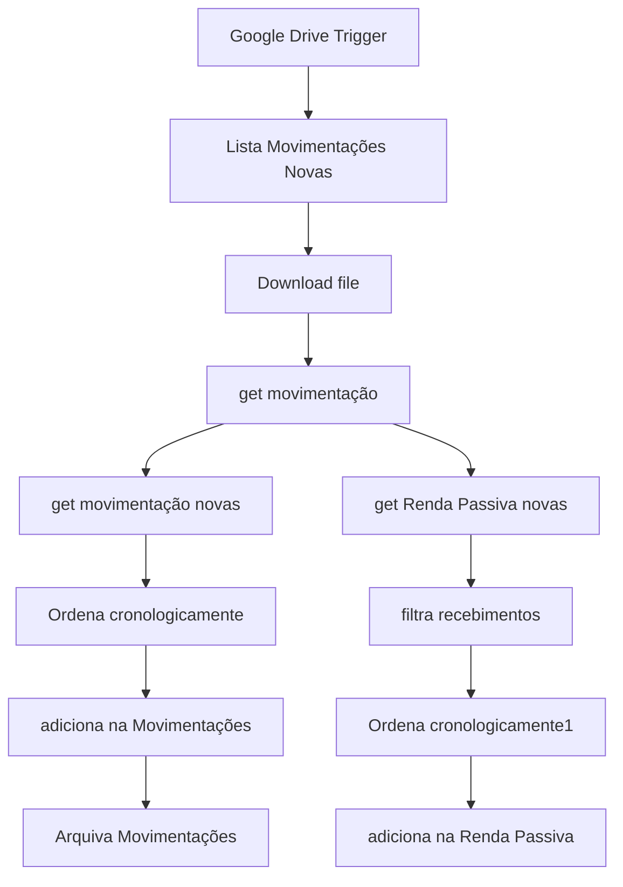

# Carteira Invest

## Contexto geral do projeto

### Identificação

#### Nome do projeto

Carteira Invest

#### Tipo de projeto

Automação n8n para consulta e acompanhamento de uma carteira de investimentos.

#### Data de início

Precisa de confirmação: informar a data de início do projeto.

#### Término do projeto

Precisa de confirmação: informar a data de término ou confirmar que o projeto está em andamento.

#### Responsáveis

Precisa de confirmação: informar responsáveis e respectivos papéis.

#### Repositório

[README deste projeto no GitHub](https://github.com/jhvlima/n8n-workflows/blob/docs/generated/projects/carteira-invest/README.md)

### Cliente ou empresa

#### Nome do cliente

Precisa de confirmação: informar o cliente associado ao projeto.

#### Descrição da empresa

Precisa de confirmação: descrever a empresa ou confirmar que este campo não se aplica.

#### Perfil e dinâmica de relacionamento

Precisa de confirmação: registrar o perfil do cliente e a dinâmica de relacionamento.

##### Flexibilidade com prazos

Precisa de confirmação: informar como alterações de prazo são negociadas.

##### Frequência de respostas

Precisa de confirmação: informar a frequência ou o tempo médio de resposta.

##### Pedidos fora do escopo

Precisa de confirmação: informar se houve solicitações fora do escopo e como foram tratadas.

### Descrição do produto

Automação para processar arquivos de movimentações financeiras e organizar movimentações e recebimentos de renda passiva em planilhas.

## Identificação técnica

### Nome do agente ou automação

Carteira de Investimentos.

### Plataforma

n8n.

## O que a automação faz

### Objetivo

Identificar movimentações novas em arquivos do Google Drive, ordená-las cronologicamente, registrar os dados no Google Sheets e arquivar os arquivos processados.

### Quem usa

Precisa de confirmação: informar se a automação é usada pelo proprietário da carteira, por uma equipe financeira ou por outro público.

### Onde roda

O fluxo é executado no n8n e integra Google Drive e Google Sheets. Precisa de confirmação: informar o ambiente de hospedagem da instância n8n.

### O que dispara a automação

O node `Google Drive Trigger` inicia o fluxo quando ocorre o evento configurado no Google Drive.

### Fluxo principal

1. Lista e baixa os arquivos com movimentações novas no Google Drive.
2. Extrai as movimentações do arquivo.
3. Separa movimentações gerais e recebimentos de renda passiva.
4. Filtra e ordena os registros cronologicamente.
5. Adiciona os dados nas planilhas correspondentes do Google Sheets.
6. Arquiva os arquivos de movimentações processados no Google Drive.

### Entradas e saídas

- **Entradas:** arquivos de movimentações financeiras disponíveis no Google Drive.
- **Saídas:** registros adicionados às planilhas de Movimentações e Renda Passiva, além do arquivamento dos arquivos processados.

## Como foi construída

### Modelo

Não se aplica: nenhum modelo de inteligência artificial foi identificado no workflow sanitizado.

### Componentes

- **Carteira de Investimentos:** workflow principal com nodes de Google Drive, extração de arquivo, filtro, ordenação, merge e Google Sheets.

### Integrações e APIs

- **Google Drive:** detecta, lista, baixa e arquiva arquivos de movimentações.
- **Google Sheets:** consulta registros arquivados e adiciona movimentações e renda passiva.

### Banco de dados

Nenhum banco de dados dedicado foi identificado. As planilhas do Google Sheets funcionam como armazenamento dos registros financeiros processados.

### Gravação explicada

Precisa de confirmação: adicionar o link de um vídeo percorrendo o workflow e explicando suas regras de negócio.

## Workflows documentados

- [Carteira de Investimentos](docs/workflows/carteira-de-investimentos.md) — Workflow.

## Arquitetura do fluxo

## Prompts e lógicas do agente

Não se aplica: nenhum agente de IA ou prompt foi identificado neste projeto.

## Tools

Não se aplica: nenhum Agent Tool ou Workflow Tool foi identificado no workflow sanitizado.

## Bugs conhecidos

Nenhum bug conhecido foi documentado no snapshot sanitizado. Precisa de confirmação humana antes de considerar esta lista completa.

## Riscos

- Indisponibilidade ou alteração de permissões nas APIs do Google pode interromper o processamento.
- Mudanças no formato dos arquivos de entrada podem afetar a extração das movimentações.
- Regras de deduplicação e consistência financeira precisam ser confirmadas pelo responsável do projeto.

## Pontos que precisam de confirmação

- Público responsável por usar e acompanhar a automação.
- Ambiente em que a instância n8n está hospedada.
- Link da gravação explicativa.
- Formato esperado dos arquivos e regras completas de deduplicação.
- Políticas de segurança e privacidade aplicadas aos dados financeiros.
