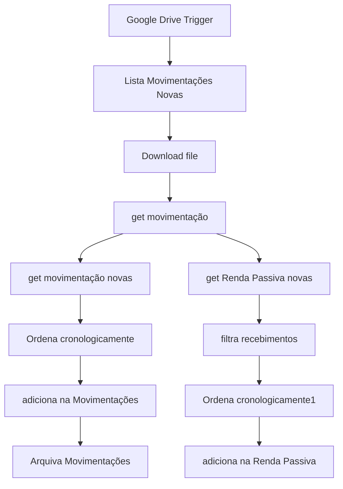

# Carteira Invest

## Visão Geral
O projeto 'Carteira Invest' envolve a gestão e análise de investimentos através de um workflow automatizado no n8n, que processa movimentações financeiras.

## Componentes
- **Carteira de Investimentos**: Workflow principal que gerencia e processa as movimentações de investimentos.

## Fluxo Principal
O workflow 'Carteira de Investimentos' é acionado por um gatilho do Google Drive, processa arquivos de movimentações financeiras, e atualiza registros em planilhas do Google Sheets.

## Entradas e Saídas
- **Entradas**: Arquivos de movimentações financeiras no Google Drive.
- **Saídas**: Registros atualizados em planilhas do Google Sheets.

## Integrações
- Google Drive
- Google Sheets

## Operação
O workflow é acionado automaticamente por eventos de atualização de arquivos no Google Drive especificados.

## Riscos
- Interrupção do acesso às APIs do Google pode afetar a operacionalidade.
- Falhas na autenticação ou permissões inadequadas nos arquivos e planilhas.

## Pontos que Precisam de Confirmação
- Detalhes específicos sobre os dados processados e regras de negócio aplicadas.
- Configurações de segurança e privacidade relacionadas ao acesso aos dados no Google Drive e Google Sheets.

## Arquitetura

[Abrir a fonte do diagrama](docs/architecture.mmd)
