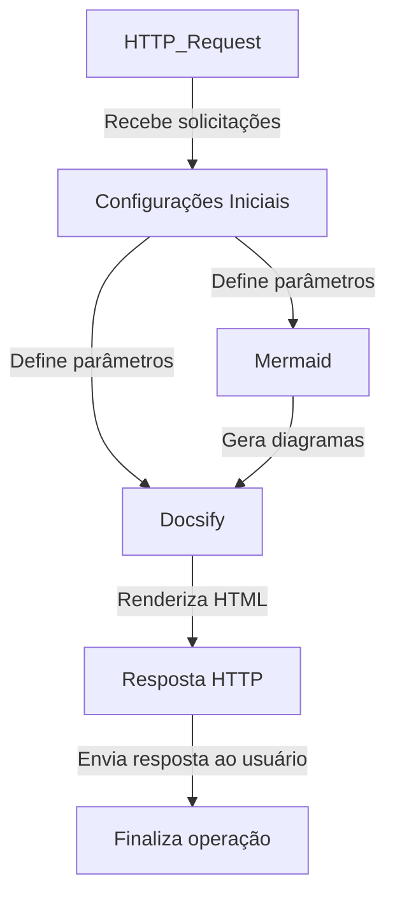

# Mvp Docs

## Contexto geral do projeto

### Identificação

#### Nome do projeto

Mvp Docs

#### Tipo de projeto

Sistema de documentação automatizada de projetos e workflows n8n.

#### Data de início

Precisa de confirmação: informar a data de início do projeto.

#### Término do projeto

Precisa de confirmação: informar a data de término ou confirmar que o projeto está em andamento.

#### Responsáveis

Precisa de confirmação: informar responsáveis e respectivos papéis.

#### Repositório

[README deste projeto no GitHub](https://github.com/jhvlima/n8n-workflows/blob/docs/generated/projects/mvp-docs/README.md)

### Cliente ou empresa

#### Nome do cliente

Precisa de confirmação: informar o cliente associado ao projeto.

#### Descrição da empresa

Precisa de confirmação: descrever a empresa ou confirmar que este campo não se aplica.

#### Perfil e dinâmica de relacionamento

Precisa de confirmação: registrar o perfil do cliente e a dinâmica de relacionamento.

##### Flexibilidade com prazos

Precisa de confirmação: informar como alterações de prazo são negociadas.

##### Frequência de respostas

Precisa de confirmação: informar a frequência ou o tempo médio de resposta.

##### Pedidos fora do escopo

Precisa de confirmação: informar se houve solicitações fora do escopo e como foram tratadas.

### Descrição do produto

Automação para gerar, visualizar, editar e salvar documentação interna de workflows n8n em arquivos Markdown e páginas HTML.

## Identificação técnica

### Nome do agente ou automação

MVP - Documentação Interna n8n (Local).

### Plataforma

n8n.

## O que a automação faz

### Objetivo

Consultar workflows da instância, gerar documentação e diagramas, servir páginas de visualização e permitir a edição e gravação de arquivos de documentação.

### Quem usa

Precisa de confirmação: informar as equipes ou pessoas autorizadas a consultar e editar a documentação interna.

### Onde roda

O processamento ocorre no n8n e a interface é exposta por webhooks que retornam HTML ou Markdown. O nome do workflow indica uso local; o ambiente exato precisa de confirmação.

### O que dispara a automação

Requisições HTTP nos webhooks `single workflow` e `docsify` iniciam as rotas de consulta, edição ou visualização.

### Fluxo principal

1. Recebe uma solicitação HTTP.
2. Consulta workflows e tags da instância n8n quando necessário.
3. Carrega ou cria arquivos de documentação.
4. Utiliza uma cadeia LLM para gerar conteúdo estruturado.
5. Monta Markdown, HTML e diagramas Mermaid.
6. Responde à solicitação ou salva a edição em arquivo.

### Entradas e saídas

- **Entradas:** solicitações HTTP, dados de workflows e arquivos locais de documentação.
- **Saídas:** páginas HTML, Markdown, diagramas e arquivos de documentação gravados localmente.

## Como foi construída

### Modelo

O node `OpenAI Chat Model` é utilizado pelo `Basic LLM Chain`, com parsers de saída estruturada e correção automática.

### Componentes

- Webhooks para consulta e interface Docsify.
- Nodes da API n8n para workflows e tags.
- Leitura e gravação de arquivos locais.
- Cadeia LLM com OpenAI e parsers estruturados.
- Geração de HTML, Markdown e Mermaid.

### Integrações e APIs

- **API n8n:** consulta workflows e tags.
- **OpenAI:** geração assistida de conteúdo.
- **Docsify e Mermaid:** apresentação da documentação e dos diagramas.
- **Sistema de arquivos:** leitura e gravação dos documentos.

### Banco de dados

Nenhum banco de dados dedicado foi identificado. A persistência observada utiliza arquivos no sistema local.

### Gravação explicada

Precisa de confirmação: adicionar o link de um vídeo percorrendo as rotas, a geração por IA e a persistência dos documentos.

## Workflows documentados

- [MVP - Documentação Interna n8n (Local)](docs/workflows/mvp-documentacao-interna-n8n-local.md) — Workflow.

## Arquitetura do fluxo

## Prompts e lógicas do agente

O projeto utiliza um `Basic LLM Chain` com OpenAI e parsers estruturados para gerar conteúdo. O texto dos prompts foi sanitizado e não está disponível nesta documentação; precisa ser revisado na instância n8n autorizada.

## Tools

Não se aplica: nenhum Agent Tool ou Workflow Tool foi identificado no workflow sanitizado.

## Bugs conhecidos

Nenhum bug conhecido foi documentado no snapshot sanitizado. Precisa de confirmação humana antes de considerar esta lista completa.

## Riscos

- Execução local de comandos e escrita de arquivos exigem controle de acesso ao ambiente.
- Conteúdo gerado por IA precisa de revisão antes de ser tratado como documentação oficial.
- Webhooks de edição precisam de autenticação e validação de entrada.

## Pontos que precisam de confirmação

- Pessoas e equipes autorizadas a editar a documentação.
- Ambiente e caminhos usados para persistir os arquivos.
- Proteções aplicadas aos webhooks.
- Conteúdo e política de revisão dos prompts.
- Link da gravação explicativa.
